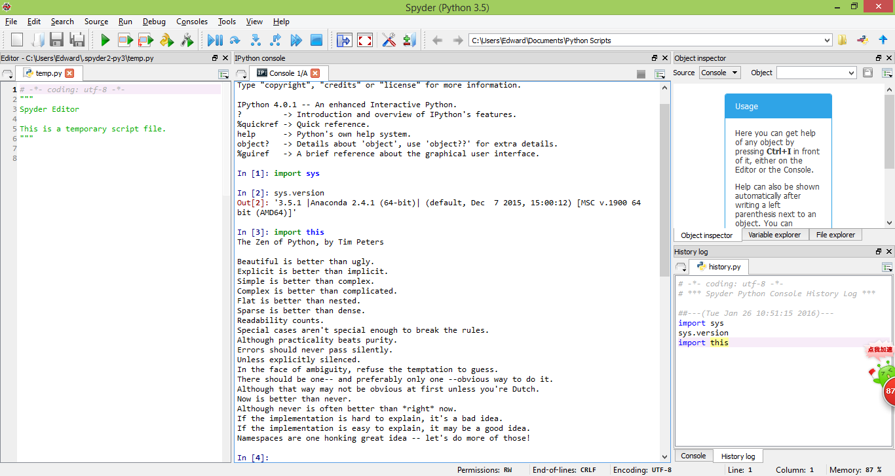

UECM3033 Assignment #1 Report
========================================================

- Prepared by: ** See Boon Chai**
- Tutorial Group: T3

--------------------------------------------------------

## Task 1 -- setup a github repository

The reports, codes and supporting documents are uploaded to Github at: 

[https://github.com/1300400/UECM3033_assign1](https://github.com/your_github_id/UECM3033_assign1)

---------------------------------------------------------

## Task 2 -- setup python

Put here the screen shot of file (python.png)

------------------------------------------------------------

## Task 3 -- modify and run Python script

In this section, please report:

1. The hexadecimal value of your student ID.
2. Write down the definite integrals that you have chosen.
3. Write down your system of 10 linear equations.

Here are the examples of how to add equations in markdown:

$$\int_0^{\infty} e^{-x^2} dx = \frac{\sqrt{\pi}}{2}.$$

\begin{align*}
3 x_0 +x_1 &= 9,\\
x_0 + 2 x_1 &= 8.
\end{align*}

ANSWER

1.The hexadecimal representation of 1300400 is 0x13d7b0

2.$$\int_0^1 cos(x^2) dx = \sqrt(2)\times\sqrt(pi)\times fresnels(sqrt(2)\div sqrt(pi))\times Γ(1/4)\times Γ(5/4)$$

 [which actually means: sqrt(2)*sqrt(pi)*fresnelc(sqrt(2)/sqrt(pi))*gamma(1/4)/(8*gamma(5/4)) in python]

3.  \begin{align}x_0+x_1+2x_2+2x_3+3x_4+4x_5+5x_6+6x_7+6x_8+7x_9 ,&=9,
    X_0+2x_1+4x_2+5x_3+6x_4+7x_5+4x_6+5x_7+7x_8+8x_9 ,&=8,
    X_0+2x_1+3x_2+4x_3+5x_4+6x_5+7x_6+8x_7+8x_8+9x_9 ,&=4,
    4x_0+6x_1+7x_2+8x_3+9x_4+4x_5+3x_6+2x_7+3x_8+2x_9 ,&=5,
    4x_0+6x_1+7x_2+8x_3+7x_4+4x_5+3x_6+8x_7+3x_8+2x_9,&=6,
    4x_0+6x_1+7x_2+7x_3+9x_4+8x_5+7x_6+6x_7+3x_8+2x_9 ,&=7,
    8x_0+5x_1+7x_2+7x_3+9x_4+4x_5+3x_6+6x_7+3x_8+2x_9 ,&=4,
    5x_0+6x_1+4x_2+8x_3+4x_4+4x_5+3x_6+5x_7+7x_8+2x_9, &=5,
    4x_0+6x_1+7x_2+8x_3+9x_4+4x_5+3x_6+2x_7+3x_8+2x_9,&=6,
    5x_0+7x_1+9x_2+7x_3+7x_4+4x_5+8x_6+2x_7+4x_8+2x_9 ,&=7 \end{align}

 Solution(for 10 variables) =
\begin{align}x_0 &= -4.96321436e+14, \x_1 &= -6.10737000e+14, \x_2 & =  5.69865001e+14, \x_3 & = -5.49559167e+14, \x_4 &=  6.18742184e+14, \x_5 &= -2.40643655e+14,\ x_6 & = -1.02993532e+14, \x_7  &= 2.06247395e+14, \x_8 &=  1.17022129e+15, \x_9 &=  -1.08157852e+15.\end{align}

-----------------------------------

last modified: change your date here
